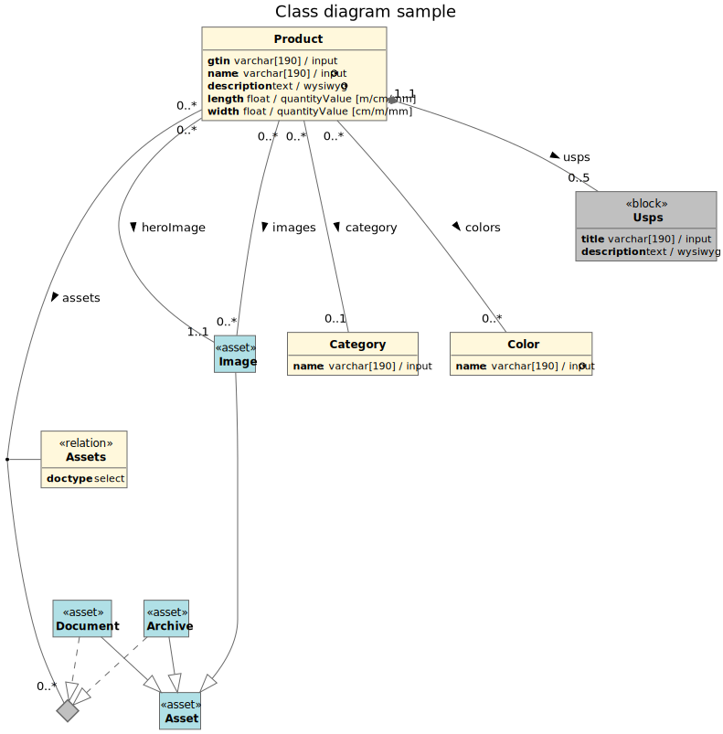

# PlantUML class diagram generation based on pimcore class definition

## Requirements
* Pimcore >= 10

## Introduction
This bundle lets you create UML class diagrams based on the class definition as defined in your project.
Actually your workflow normally is the other way around - you set up Pimcore based on your project's requirements, 
which probably involves some modelling. 

However too often hand-crafted models get outdated. This is where this bundle becomes useful. It creates the source
code for [PlantUML](https://plantuml.com/), which is a (human readable) text based UML rendering engine. 

PlantUmlBundle does not create the diagram **image file** for you, but the **plantuml source**.
This is for following reasons:
  * Having the source code, you still can edit and version control your diagram
  * PlantUML has great IDE integration (PhpStorm, VisualCode, Atom all have their PUML extensions)

If you just want to play around with it, there is an online renderer available: 
[https://plantuml.com/plantuml](https://plantuml.com/plantuml).

### Supported data types
All Pimcore native data types are supported, namely:
  * Simple types (like text, date, number, geolocation, quantityValues, ...)
  * All Relation types, including advanced
  * Blocks
  * Classification store
  * Field collections
  * Object bricks
  * Assets and Documents with their sub types

### Installation
Nothing fancy here, just install via composer and enable via Pimcore backend or console command:

`$ composer req brunner-medien/pimcore-plantuml`

`$ bin/console pimcore:bundle:enable PlantUmlBundle`

## Usage
The PlantUmlBundle has a backend integration in Pimcore "Settings" > "PlantUML". 
This menu (along with all admin API calls) is available for the **admin user only**. 

Each configuration has its own scope. Imagine you have a large project with dozens of objects - a single class diagram 
showing all classes probably would not be very helpful. Instead, you select from the "Object" namespace tree at least 
one or more "seed" objects. Starting with these seeds, all related items become part of your class diagram. 

This way, you can break down your diagram into different aspects, showing only the information that is relevant from
one point of view. 

## Translations
If you have your class names and field labels translated (using admin translations), you can choose to use these. 
For class properties, the technical (getter) names are shown as well. 

## Templates
PlantUML source code is generated using Twig. Feel free to adjust the default template, or register your own.

config.yml:
```
plant_uml:
    templates:
        -
            name: 'CustomTemplate'
            path: '@AppBundle/PlantUml/_templates/custom_template'
```

## Classes and Stereotypes
Generating a class diagram from Pimcore's class (and object brick / classification store) definitions
usually generates some extra classes that have not been explicitly defined. This is necessary in order
to retain correct multiplicity annotations. A block field for example yields a dedicated class with its
own properties and associations, having a "0..n" association of type Composition where n is the amount of 
allowed blocks as defined in the block field.
Non-object classes have their own stereotypes and are displayed in different colors. 


## Association classes
When a relation allows multiple objects (or document / asset types), things get slightly more complicated.
There is no "standard" way to visualize such a relation in a class diagram. PlantUmlBundle creates a so 
called "association class" - an anonymous class visualized by a diamond shape. 
The allowed classes then "realize" this association class, hence have an association of type Realization. 
This probably may not be pure standard UML, but again helps to visualize your relations as correct as possible. 


## Relation classes
Relations of type "Advanced many-to-many" also create a dedicated class in between the two related classes. 
These "relation classes" have their own stereotype "relation".


## Generalization associations
Generalization associations are created for Documents and Assets and their subtypes (like Image, Video, Archive
etc).


## Example
This basic example shows some of PlantUmlBundle's features:

* "Product" object has a Pimcore block field called "usps", where up to 5 blocks are allowed.
* "Product" object has an "Advanced many-to-many" relation named "assets".
* The relation allows to define a "doctype" property in the relation class.
* Allowed asset subtypes for this relation are "Document" and "Archive", both generalize the "Asset" class.
* The "heroImage" is an image field type that is mandatory, hence a "1..1" relation.
* The "images" is a "0..*" relation of Pimcore field type image gallery.
* Both "heroImage" and "images" relate to "Image", which also generalizes "Asset".
* Product's and Color's properties "name" are localized fields, indicated by the globe symbol.
* Product's "length" and "width" properties are quantity values, where [m,cm,mm] are valid units.




Generated PUML:
```
@startuml

hide empty attributes
hide empty methods
hide circle

skinparam shadowing false
skinparam classFontStyle Bold
skinparam ActivityBackgroundColor Silver
skinparam ActivityBorderColor DimGray

skinparam class {
    BackgroundColor Cornsilk
    ArrowColor DimGray
    BorderThickness 1
    BorderColor DimGray
    BackgroundColor<<block>> Silver
    BackgroundColor<<objectbrick>> LightPink
    BackgroundColor<<fieldcollection>> LightPink
    BackgroundColor<<classification>> LightPink
    BackgroundColor<<asset>> PowderBlue
    BackgroundColor<<document>> PaleGreen
}

title "Class diagram sample"

class "Image" as Asset\Image <<asset>> {
}

class "Asset" as Asset <<asset>> {
}

class "Category" as Object\Category {
    **name**: varchar[190] / input
}

class "Color" as Object\Color {
    **name**: varchar[190] / input <&globe>
}

class "Product" as Object\Product {
    **gtin**: varchar[190] / input
    **name**: varchar[190] / input <&globe>
    **description**: text / wysiwyg <&globe>
    **length**: float / quantityValue [m/cm/mm]
    **width**: float / quantityValue [cm/m/mm]
}

diamond Object\Product\Assets\Association

class "Archive" as Asset\Archive <<asset>> {
}

class "Document" as Asset\Document <<asset>> {
}

class "Assets" as Object\Product\Assets <<relation>> {
    **doctype**:  select
}

class "Usps" as Object\Product\Usps <<block>> {
    **title**: varchar[190] / input
    **description**: text / wysiwyg
}

Asset\Image --|> Asset
Asset\Archive ..|> Object\Product\Assets\Association
Asset\Archive --|> Asset
Asset\Document ..|> Object\Product\Assets\Association
Asset\Document --|> Asset
Object\Product "0..*" --- "0..*" Object\Color : colors >
Object\Product "0..*" --- "0..1" Object\Category : category >
Object\Product "0..*" --- "1..1" Asset\Image : heroImage >
Object\Product "0..*" --- "0..*" Asset\Image : images >
Object\Product "0..*" ---- "0..*" Object\Product\Assets\Association : assets >
(Object\Product,Object\Product\Assets\Association) -- Object\Product\Assets
Object\Product "1..1" *-- "0..5" Object\Product\Usps : usps >

@enduml
```